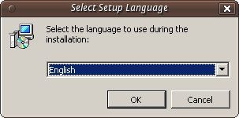
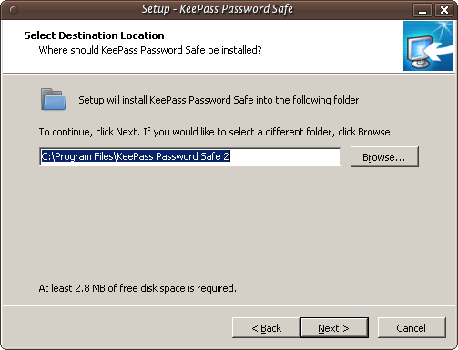
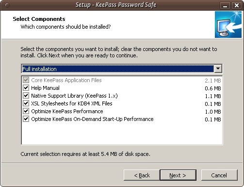
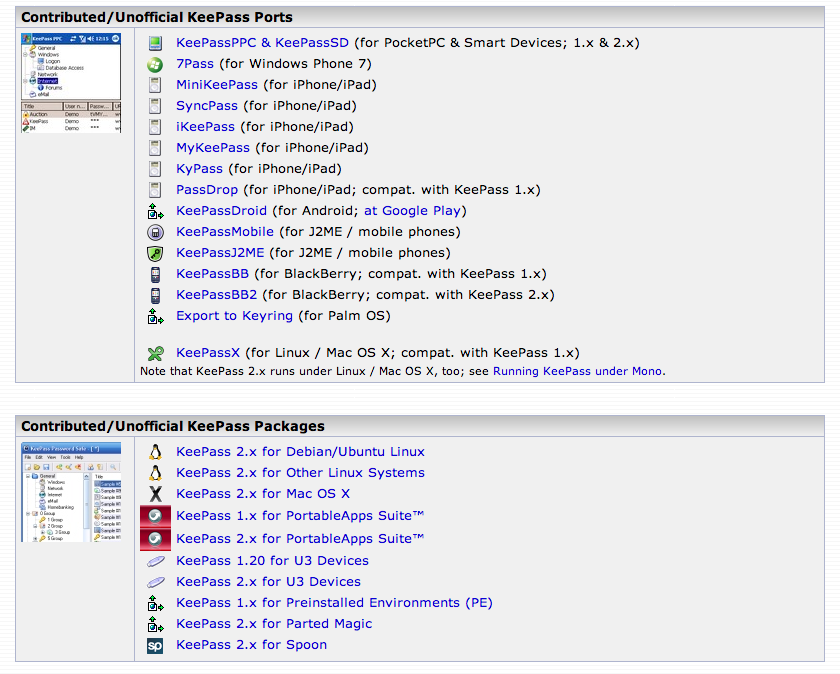
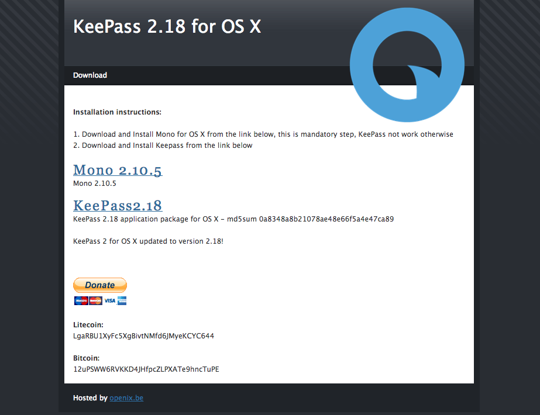
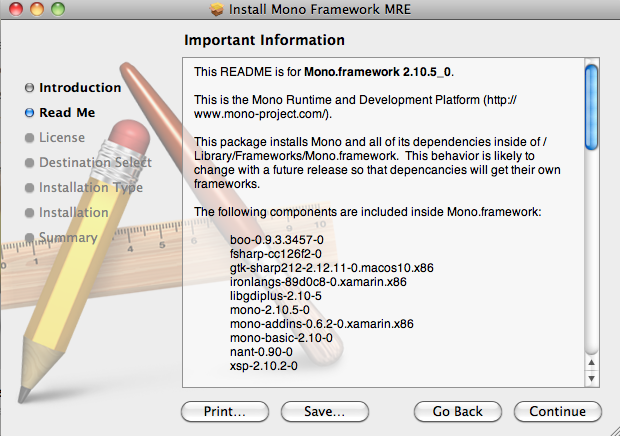
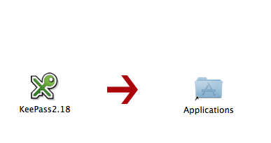

Installing KeePass
==================

We will cover installing KeePass on Ubuntu and Windows.

Mac OSX comes with an excellent built-in password manager called Keychain that is just as safe. Downsides are that it isn't Open Source and doesn't work on other systems. If you'd need to take your passwords from one Operating System to another it is better to stick with Keepass after all. How to use Keychain is covered in the next chapter.

Installing KeePassX on Ubuntu
-----------------------------

To install on Ubuntu we will use the Ubuntu Software Center. Type KeePass in the search field at the top right and the application KeePassX should automatically appear in the listing. 

Highlight the item (it may already be highlighted by default) and then press 'Install'. You will be asked to Authorise the installation process:

Enter your password and press 'Authenticate' the installation process will then begin. 

Ubuntu does not offer very good feedback to show the software is installed. If the green progress indicator on the left has gone and the progress bar on the right has gone then you can assumed the software is installed.

Installing KeePass on Windows
-----------------------------

First visit the [KeePass download webpage](http://keepass.info/download.html) and choose the appropriate installer. For this chapter we are using the [current installer](http://downloads.sourceforge.net/keepass/KeePass-2.15-Setup.exe).

Download this to your computer then double click on the installer. You will first be asked to select a language, we will choose English:

Press 'OK' and you will be shown the following screen:

Just press 'Next >' and go to the next screen:

In the screen shown above we must select 'I accept the agreement' otherwise we will not be able to install the software. Choose this option and then press 'Next >'. In the next screen you will be asked to determine the installation location. You can leave this with the defaults unless you have good reason to change them.

Click on 'Next >' and continue.

The above image shows the KeePass components you can choose from. Just leave the defaults as they are and press 'Next >'. You will come to a new screen:

This doesn't do anything but give you a summary of your options. Press 'Install' and the installation process will begin.

Installing KeePass on Mac OS X
------------------------------

Although Keychain in Mac OS X does an excellent job of storing your passwords, you may want to run your own password database and manager. KeePass allows this added flexibility. First visit the KeePass download webpage (http://keepass.info/download.html) and choose the appropriate installer. Although the official installers are listed at the top of the page, there are unofficial/contributed installers further down. Scroll down to find [KeePass 2.x for Mac OS X](http://keepass2.openix.be/):

As this is an external link, your browser will be redirected to [http://keepass2.openix.be/](http://keepass2.openix.be/):

Note here that you must install the Mono framework first, so that KeePass can run in OS X. So click on each of the links [Mono 2.10.5](http://download.mono-project.com/archive/2.10.5/macos-10-x86/0/MonoFramework-MRE-2.10.5_0.macos10.xamarin.x86.dmg) and [KeePass2.18](http://keepass2.openix.be/KeePass2.18.dmg) to download the DMG files to your computer. Double-click on each of the DMGs in your downloads folder to unpack the volumes to your desktop.

The Mono Package installer is called 'MonoFramework-MRE-2.10.5_0.macos10.xamarin.x86.pkg', so double-click on this document in the MonoFramework volume on your desktop:

The installer will open and run:

Follow each of the steps by clicking 'Continue', the next step being 'Read Me'. Inhere is important information such as all of the files that the package will install, including information on how to uninstall Mono:

Click 'Continue' to the next screen, the license. Clicking 'Continue' on the license screen pops up the agree/disagree dialogue box. If you agree with the license conditions, the installation will continue:

The following two steps in the installation ask you to choose an installation destination, and check there is enough space on the install disk. When the installation has completed, you will see this screen:

Now you can quit the installer. Next take a look at the KeePass disk image, double-click to open it, and drag the KeePass application into your Applications folder:

 

Now KeePass is ready to use for Mac OS X.