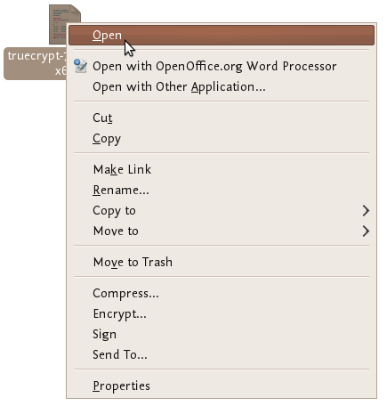
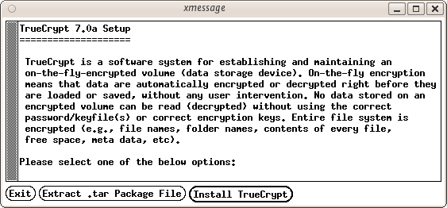
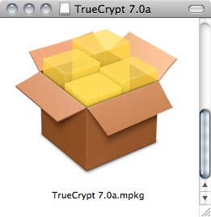
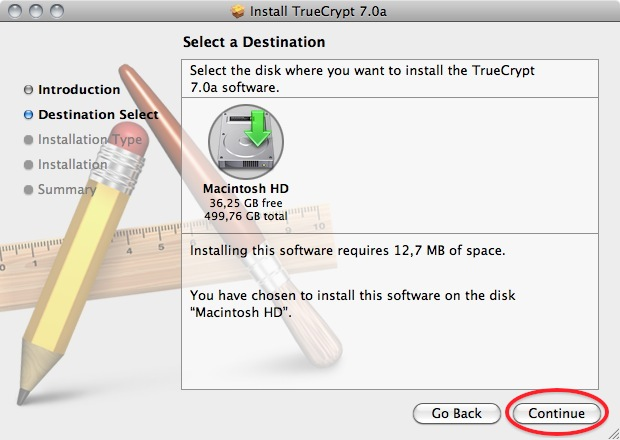
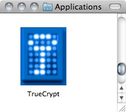

Installing TrueCrypt
====================

TrueCrypt can be installed on Windows, Linux, or Mac OSX. The installation files are available here: [http://www.truecrypt.org/downloads](http://www.truecrypt.org/downloads)

The following gives complete detail on how to install TrueCrypt on your computer for each of these Operating Systems, starting with Ubuntu.

Installing on Ubuntu
--------------------

TrueCrypt is not available in the standard Ubuntu repositories. This means you cannot use the Ubuntu Software Center or *apt-get* (a command line method for installing software on Ubuntu) to install it. Instead you must first visit the TrueCrypt downloads page ([http://www.truecrypt.org/downloads](http://www.truecrypt.org/downloads)).

You will see a drop-down menu under the heading Linux.

From the '(Select a package)' drop down menu you can choose from four options:

This is a little technical - the console version is the one you choose if you are either very technical and don't like Graphical User Interfaces or you wish to run this on a machine that you have only a terminal (command line or 'shell') access to (like a remote server for example).

Assuming you are running this in your laptop its best to choose the easy 'standard' option - this will give you a nice user interface to use. From these two options you need to choose the one most suitable for the *architecture* of your machine. Don't know what this means? Well, it basically comes down to the type of hardware (processor) running on your computer, the options are 32-bit or 64-bit. Unfortunately Ubuntu does not make it easy for you to find this information if you don't already know it. You need to open a 'terminal' from the Applications->Accessories menu and type the following, followed by the [enter] key

    uname -a

The output will be something like `Linux bigsy 2.6.32-30-generic #59-Ubuntu SMP Tue Mar 1 21:30:46 UTC 2011 x86_64 GNU/Linux`. In this instance you can see the architecture is 64-bit (`x86_64`). In this example I would choose the 'Standard - 64-bit (x64)' option. If you see `i686` somewhere in the output of the uname command then you would choose the other standard option to download.

Once selected press the 'download' button and save the file to somewhere on your computer.

So the installation process is still not over. The file you downloaded is a compressed file (to make downloading it is faster) and you need to first de-compress the file before you install it. Fortunately Ubuntu makes this easy - simply browse to the file on your computer and right click on it and choose 'Extract Here'.

You will see a new file appear next to the compressed file:

Nearly done! Now right click on the new file and choose 'open':

If all is well you will see a window open like this:

Choose 'run' and you see the following:

Now we are getting somewhere...press 'Install TrueCrypt'. You will be displayed a user agreement. At the bottom press 'I accept and agree to be bound by the license terms' (sounds serious). You will then be shown another info screen telling you you can uninstall TrueCrypt. Press 'OK' then you will be asked for your password to install software on your computer. Enter your password and then you will finally see a screen like this:

Believe it or now your are done...TrueCrypt is installed and you can access it from the Applications->accessories menu...close the setup window. Now proceed to the chapter on Using TrueCrypt.

Installing on OSX
-----------------

 1. To install TrueCrypt on OSX first visit the download page ([http://www.truecrypt.org/downloads](http://www.truecrypt.org/downloads)) and press the download button under the OSX section.

 

 2. Download this to your computer find the .dmg file and open it to access the installation package.

 

 3. Open the installation package, and click away through the dialogues.

 

 4. Choose the standard installation. (you can choose to do a customized installation and deselect FUSE, but why would you? You need it!)

 

 5. After the installation finishes you can find the program in your Applications folder

 

Installing on Windows
---------------------

To install TrueCrypt on Windows first visit the download page ([http://www.truecrypt.org/downloads](http://www.truecrypt.org/downloads)) and press the download button under the Windows section.

Download this to your computer and then double click on the file. You will see a license agreement.

Click on 'I accept and agree to be bound by the license terms' and then click 'Accept'.

Leave the above screen with the defaults and press 'Next >' and you will be taken to the Setup Options window:

You can leave this with the defaults. If you want to set up TrueCrypt just for yourself then consider not selecting the 'Install for all users'. However if you are installing this on your own machine and no one else uses the computer then this is not necessary. You may also wish to consider installing TrueCrypt in a folder other than the default. In which case click 'Browse' and choose another location. When you are done click 'Install' and the process will proceed:

When the installation is complete you will get a verification popup that it was successful. Close this window and click 'Finish' and all is done. Now proceed to the chapter on Using TrueCrypt.
